## Qwen2
当前模块属于CANN LLM大预言模型解决方案中，Qwen2.5, Qwen3, Deepseek与智谱等模型在npu上适配，导出NPU亲和适配的友好结构onnx模型的模块。

## 适配模型
当前发布版本支持Qwen2.5-1.5B,DeepSeek-R1-Distill-Qwen-1.5B,GLM-1.5b,Qwen2.5-7B-Instruct,Qwen3-8B模型

## 模型NPU亲和适配

以Qwen2为例,Qwen2与Qwen2.5等LLM模型结构在Transformer库中的定义是modeling_qwen2.py，为了最大化利用NPU，需要对该文件实现NPU亲和的适配修改.  
Qwen3与智谱的modeling文件在对应文件夹中

### 1. 多维算子优化 
Transformer库的modeling_qwen2.py中，repeat_kv函数的作用是将Key（K）和Value（V）张量的头数（n_kv_heads）通过重复拓展，使其与Query（Q） 的头数（n_head）匹配，这是为了支持分组查询注意力（Grouped Query Attention, GQA）机制，即多头注意力中，运行Key和Value的头数少于Query的 头数（例如n_kv_heads = n_head // 8），从而减少计算量和显存占用，同时通过重复操作保持注意力计算的兼容性。 

原生实现：
```
def repeat_kv(hidden_states: torch.Tensor, n_rep: int) -> torch.Tensor:
    batch, num_key_value_heads, slen, head_dim = hidden_states.shape
    if n_rep == 1:
        return hidden_states
    hidden_states = hidden_states[:, :, None, :, :].expand(batch, num_key_value_heads, n_rep, slen, head_dim)
    return hidden_states.reshape(batch, num_key_value_heads * n_rep, slen, head_dim)
```

原始实现存在五维算子，如下：

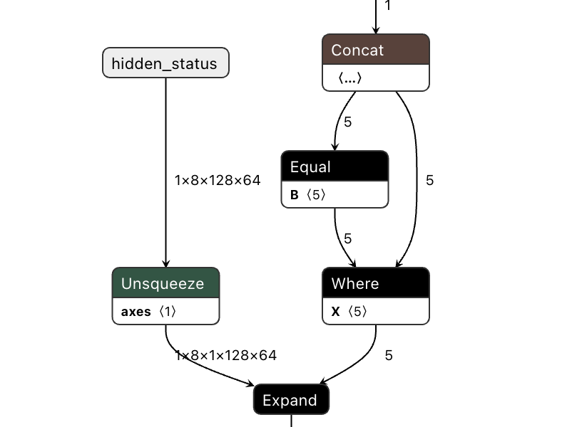

优化后的实现：

```
def repeat_kv(hidden_states: torch.Tensor, n_rep: int) -> torch.Tensor:
    batch, num_key_value_heads, slen, head_dim = hidden_states.shape
    if n_rep == 1:
        return hidden_states
    hidden_states = hidden_states.reshape(batch * num_key_value_heads, 1, -1, head_dim)
    rep_list = []
    for i in range(0, n_rep):
        rep_list.append(hidden_states)
    hidden_states = torch.cat(rep_list, dim=1)
    hidden_states = hidden_states.view(batch, num_key_value_heads * n_rep, -1, head_dim)
    return hidden_states
```

### 2. RMSNorm 算子 Pattern 优化 
Transformer库的modeling_qwen2.py中，RMSNorm的计算会对hidden_states使能pow计算，如下：

```
class RMSNorm(nn.Module):
    def __init__(self, hidden_size, eps=1e-6):
        super().__init__()
        self.weight = nn.Parameter(torch.ones(hidden_size))
        self.variance_epsilon = eps

    def forward(self, hidden_states):
        variance = hidden_states.to(torch.float32).pow(2).mean(-1, keepdim=True)
        hidden_states = hidden_states * torch.rsqrt(variance + self.variance_epsilon)

        if self.weight.dtype in [torch.float16, torch.bfloat16]:
            hidden_states = hidden_states.to(self.weight.dtype)

        return self.weight * hidden_states
```

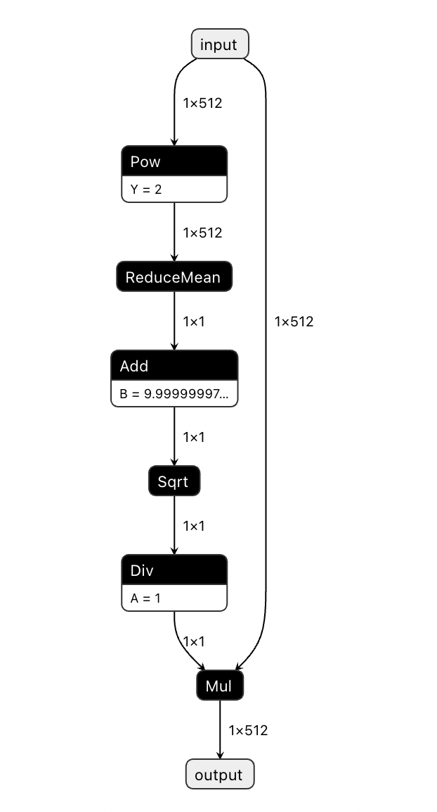

为了将算子进行融合，会将RMSNorm的Pattern修改成如下实现：

```
class RMSNorm(nn.Module):
    def __init__(self, hidden_size, eps=1e-6):
        super().__init__()
        self.weight = nn.Parameter(torch.ones(hidden_size))
        self.variance_epsilon = eps

    def forward(self, hidden_states):
        variance = (hidden_states.to(torch.float32) * hidden_states.to(torch.float32)).mean(-1, keepdim=True)
        hidden_states = hidden_states * torch.rsqrt(variance + self.variance_epsilon)

        if self.weight.dtype in [torch.float16, torch.bfloat16]:
            hidden_states = hidden_states.to(self.weight.dtype)

        return self.weight * hidden_states
```

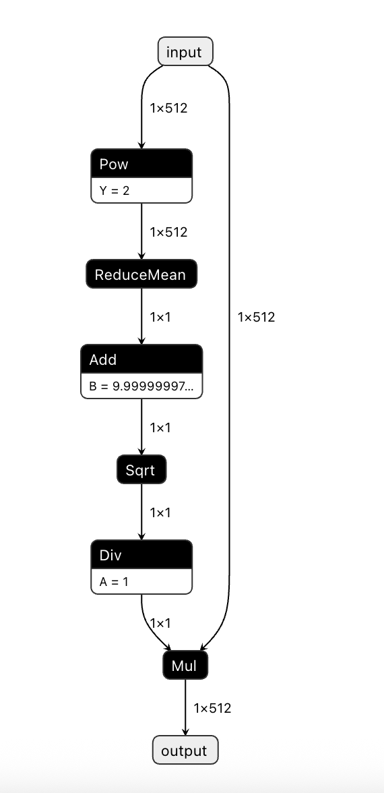


### 3. RoPE 算子优化 
Transformer库的modeling_qwen_2.py中，Rope的计算会带sin/cos的计算，如下：

```
class Qwen2RotaryEmbedding(nn.Module):
    def __init__(self, dim, max_position_embeddings=2048, base=10000, device=None):
        super().__init__()

        self.dim = dim
        self.max_position_embeddings = max_position_embeddings
        self.base = base
        inv_freq = 1.0 / (self.base ** (torch.arange(0, self.dim, 2, dtype=torch.int64).float().to(device) / self.dim))
        self.register_buffer("inv_freq", inv_freq, persistent=False)

        # build here to make 'torch.jit.trace' work
        self._set_cos_sin_cache(
            seq_len=max_position_embeddings, device=self.inv_freq.device, dtype=torch.get_default_dtype()
        )

    def _set_cos_sin_cache(self, seq_len, device, dtype):
        self.max_seq_len_cached = seq_len
        t = torch.arange(self.max_seq_len_cached, device=device, dtype=torch.int64).type_as(self.inv_freq)

        freqs = torch.outer(t, self.inv_freq)
        emb = torch.cat((freqs, freqs), dim=-1)
        self.register_buffer("cos_cached", emb.cos().to(dtype), persistent=False)
        self.register_buffer("sin_cached", emb.sin().to(dtype), persistent=False)

    def forward(self, x, seq_len=None):
        if seq_len > self.max_seq_len_cached:
            self._set_cos_sin_cache(seq_len=seq_len, device=x.device, dtype=x.dtype)
        return (
            self.cos_cached[:seq_len].to(dtype=x.dtype),
            self.cos_cached[:seq_len].to(dtype=x.dtype),
        )
```

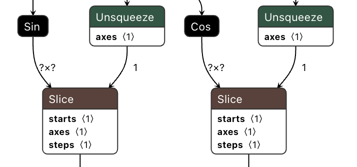


优化后：

```
class Qwen2RotaryEmbedding(nn.Module):
    def __init__(self, dim, max_position_embeddings=2048, base=10000, device=None):
        super().__init__()

        self.dim = dim
        self.max_position_embeddings = max_position_embeddings
        self.base = base
        inv_freq = 1.0 / (self.base ** (torch.arange(0, self.dim, 2, dtype=torch.int64).float().to(device) / self.dim))
        self.register_buffer("inv_freq", inv_freq, persistent=False)

        # build here to make 'torch.jit.trace' work
        self._set_cos_sin_cache(
            seq_len=max_position_embeddings, device=self.inv_freq.device, dtype=torch.get_default_dtype()
        )

    def _set_cos_sin_cache(self, seq_len, device, dtype):
        self.max_seq_len_cached = seq_len
        t = torch.arange(self.max_seq_len_cached, device=device, dtype=torch.int64).type_as(self.inv_freq)

        freqs = torch.outer(t, self.inv_freq)
        emb = torch.cat((freqs, freqs), dim=-1)
        self.register_buffer("cos_cached", emb.cos()[None, None, :, :], persistent=False)
        self.register_buffer("sin_cached", emb.sin()[None, None, :, :], persistent=False)

    def forward(self, x, seq_len=None):
        if seq_len > self.max_seq_len_cached:
            self._set_cos_sin_cache(seq_len=seq_len, device=x.device, dtype=x.dtype)
        return (
            self.cos_cached[:, :, :self.max_seq_len_cached, ...].to(dtype=x.dtype),
            self.sin_cached[:, :, :self.max_seq_len_cached, ...].to(dtype=x.dtype),
        )
```

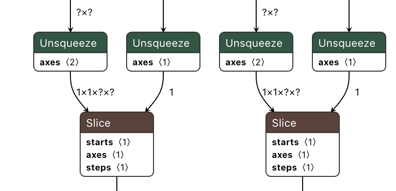

### 4. Neg算子优化 

Transformer库的modeling_qwen2.py中，rotate half的计算会带neg算子，如下：
```
def rotate_half(x):
    x1 = x[..., :x.shape[-1] // 2]
    x2 = x[..., x.shape[-1] // 2:]
    return torch.cat((-x2, x1), dim=-1)
```

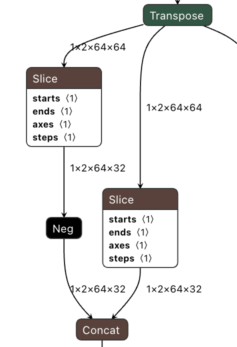


将其优化为mul算子：

```
def rotate_half(x):
    x1 = x[..., :x.shape[-1] // 2]
    x2 = x[..., x.shape[-1] // 2:]
    return torch.cat((-1 * -x2, x1), dim=-1)
```

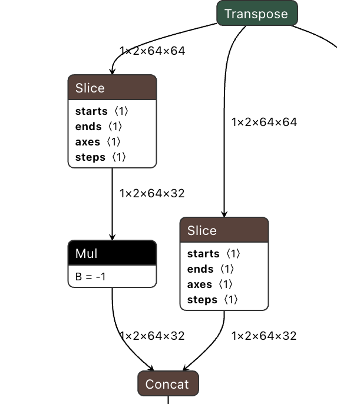

### 5.MLP算子分档shape模型优化 
CANN LLM大语言模型推理时，将LLM模型推理分成prefill和decode阶段，prefill阶段完成首字生产，按照输入Chunk是32/64/128进行推理，Decode阶段 完成自回归推理，Chunk是1，将prefill和decode过程的模型按照分档shape来设计，针对MLP算子，需要完成prefill Chunk = 64 和 decode Chunk = 1 的模型优化。 优化前：

```
class MLP(nn.Module):
    def __init__(self, hidden_size: int, intermediate_size: int, hidden_act: str):
        super().__init__()
        self.gate_proj = nn.Linear(hidden_size, intermediate_size, bias=False)
        self.down_proj = nn.Linear(intermediate_size, hidden_size, bias=False)
        self.up_proj = nn.Linear(hidden_size, intermediate_size, bias=False)
        self.act_fn = ACT2FN[hidden_act]

    def forward(self, x):
        return self.down_proj(self.act_fn(self.gate_proj(x)) * self.up_proj(x))
```

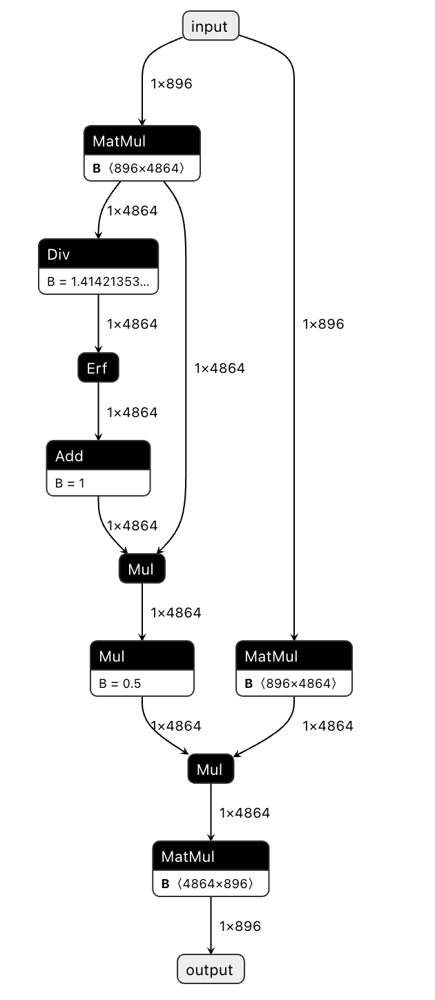


优化模型后，将Chunk Size设置到模型中：

```
class MLP(nn.Module):
    def __init__(self, hidden_size: int, intermediate_size: int, hidden_act: str):
        super().__init__()
        self.gate_proj = nn.Linear(hidden_size, intermediate_size, bias=False)
        self.down_proj = nn.Linear(intermediate_size, hidden_size, bias=False)
        self.up_proj = nn.Linear(hidden_size, intermediate_size, bias=False)
        self.act_fn = ACT2FN[hidden_act]

    def forward(self, x):
        bsz, q_len, hidden_state_len = x.size()
        x = x.view(-1, hidden_state_len)
        return self.down_proj(self.act_fn(self.gate_proj(x)) * self.up_proj(x)).view(bsz, q_len, hidden_state_len)
```

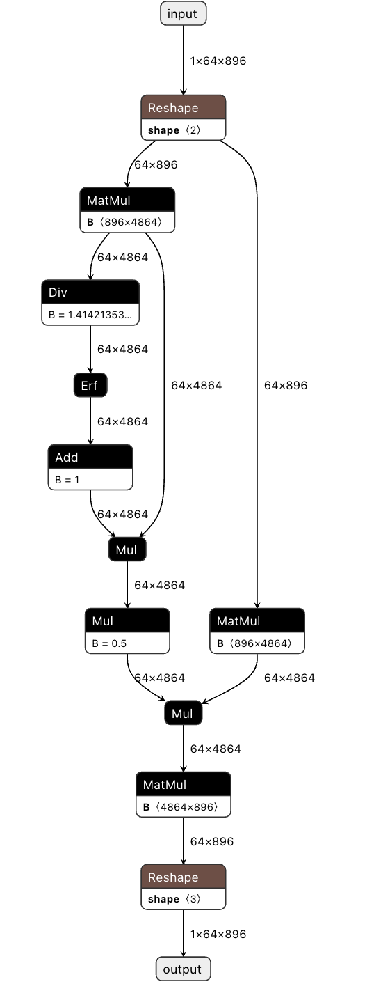


### 6. KVCache 优化 
Transformer库的modeling_qwen2.py中，KV Cache作为模型的输入，通过concat进行拼接，返回新的KV Cache，如下： 

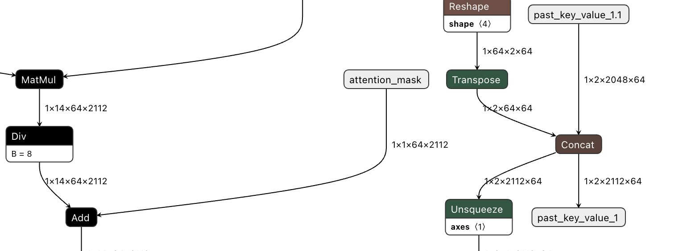

优化一是固定KV Cache的大小，优化二是对KV Cache结合scatter算子加tensor顺序调整实现ringbuffer机制，两者结合实现了高效的KV Cache管理。调整后的结构如下：

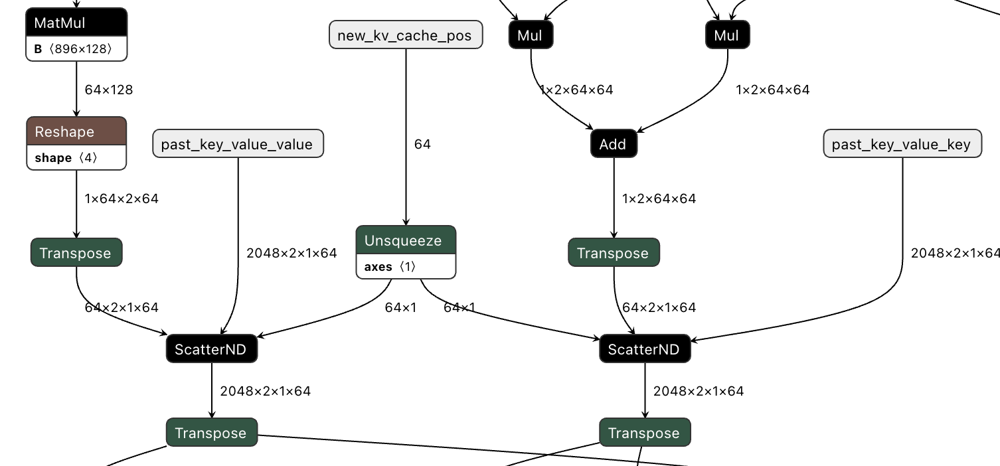

### 7. NPU亲和适配模型导出 
用户完成Transformer库的modeling_qwen2.py模型亲和适配后，CANN提供模型导出的工具链，用户基于该工具链，即可完成onnx模型的导出。输入是：量化后 的模型权重 + Transformer库modeling_qwen2.py，输出是onnx模型。